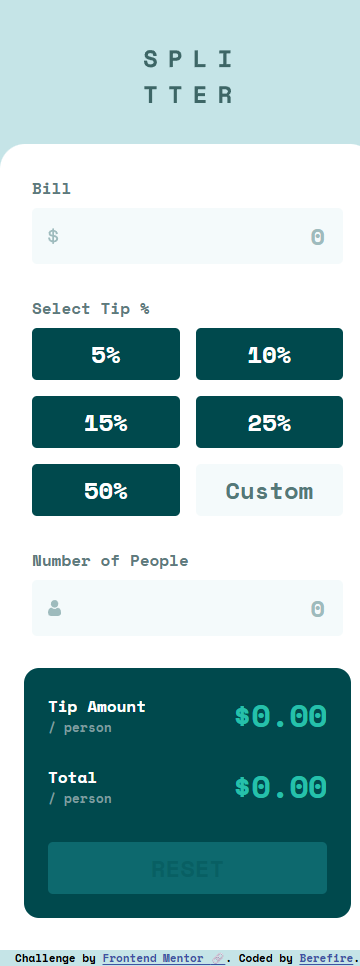
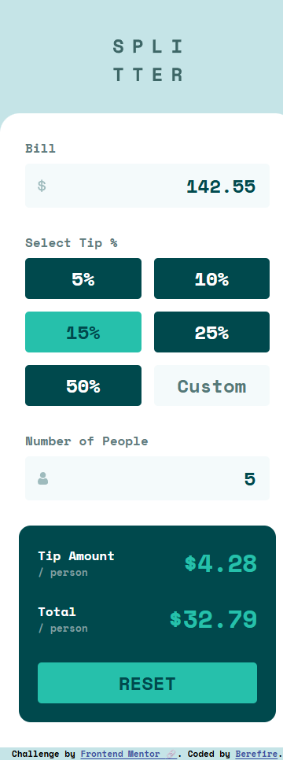
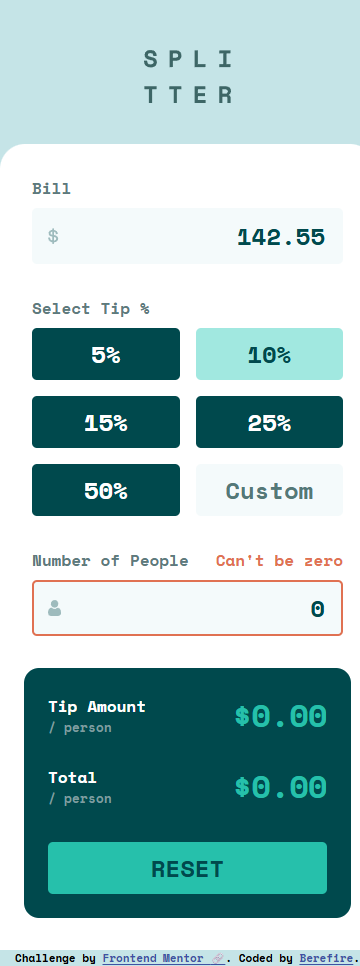
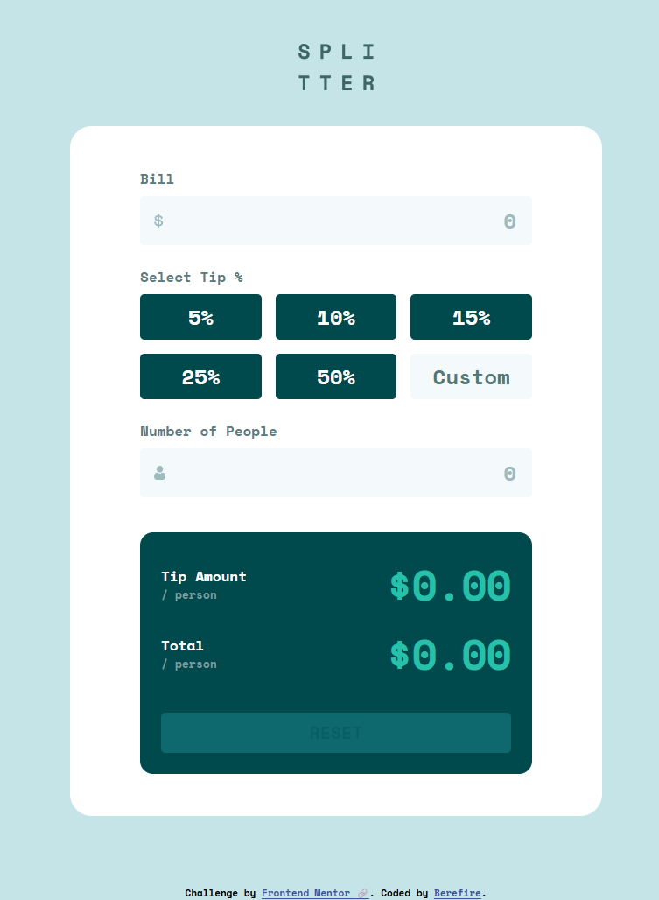
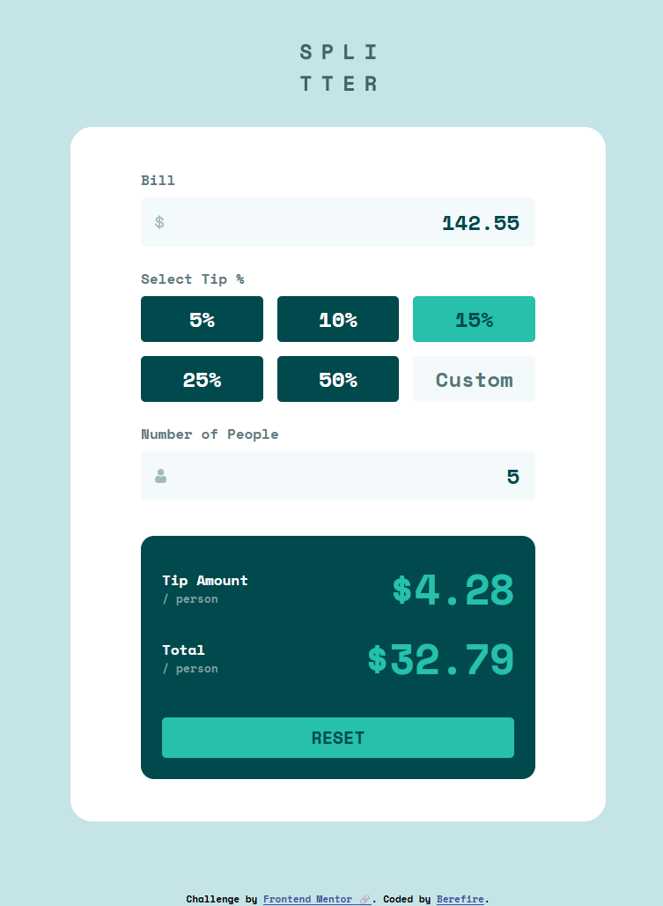
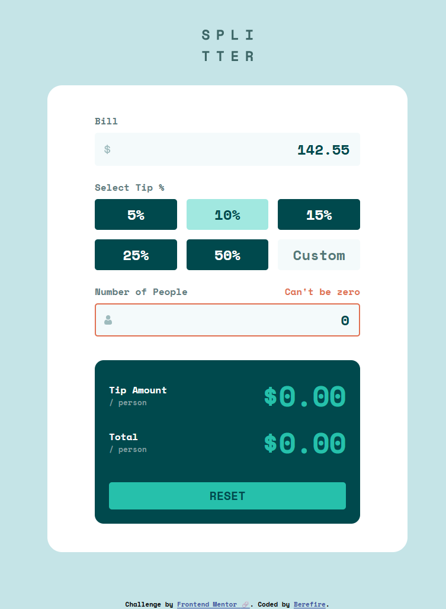
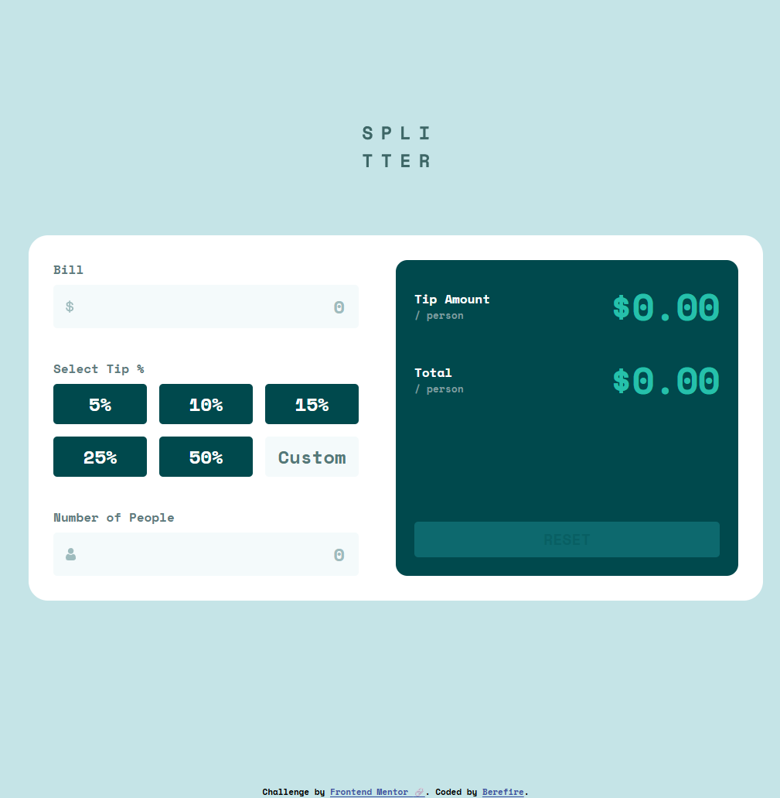
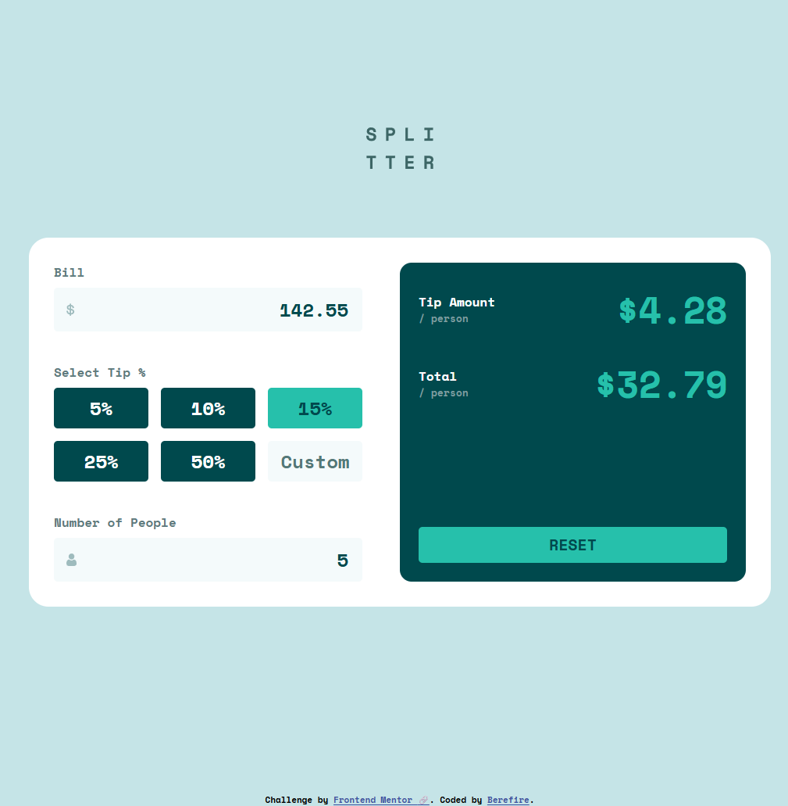
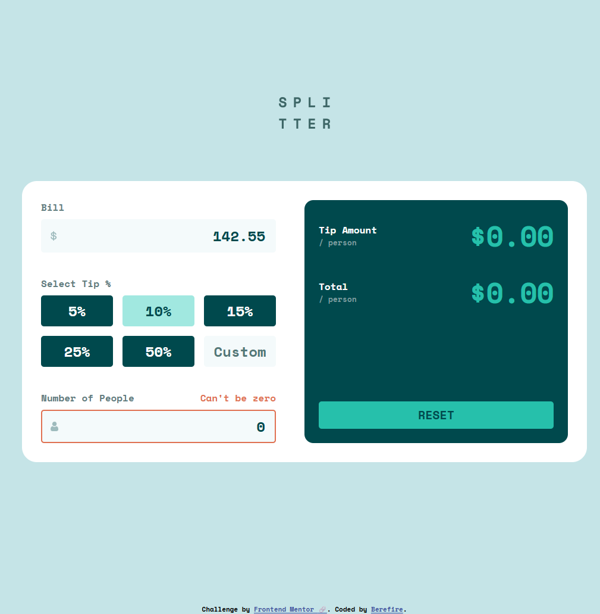

# Frontend Mentor - Tip calculator app solution


[](https://www.frontendmentor.io/)
[](https://vitejs.dev)


This is a solution to the [Tip calculator app challenge on Frontend Mentor](https://www.frontendmentor.io/challenges/tip-calculator-app-ugJNGbJUX). Frontend Mentor challenges help you improve your coding skills by building realistic projects.

## Table of contents

- [Overview](#overview)
  - [The challenge](#the-challenge)
  - [Screenshot](#screenshot)
  - [Links](#links)
- [My process](#️my-process)
  - [Built with](#built-with)
  - [What I learned](#what-i-learned)
  - [Continued development](#continued-development)
  - [Useful resources](#useful-resources)
  - [AI Collaboration](#ai-collaboration)
- [Author](#author)
- [Acknowledgments](#acknowledgments)

---

## 📖Overview

### The challenge

Users should be able to:

- View the optimal layout for the app depending on their device's screen size
- See hover states for all interactive elements on the page
- Calculate the correct tip and total cost of the bill per person

---

### 📸Screenshot

#### Mobile (375x914)

| _Default_ | _Active_ | _Error_ |
| --------- | -------- | ------- |
|  |  |  |

#### Tablet (768x914)

| _Default_ | _Active_ | _Error_ |
| --------- | -------- | ------- |
|  |  |  |

#### Desktop (1024x914)

| _Default_ | _Active_ | _Error_ |
| --------- | -------- | ------- |
|  |  |  |

---

### 🔗Links

- Solution URL: [Add solution URL here](https://your-solution-url.com)
- Live Site URL: [https://berefire.github.io/tip-calculator-app-main/](https://berefire.github.io/tip-calculator-app-main/)

---

## ⚙️My process

### 🛠Built with

- Semantic HTML5 markup
- CSS custom properties
- Flexbox
- CSS Grid
- Mobile-first workflow
- Vanilla JavaScript (ES Modules)

---

### 💡What I learned

This project helped me improve several important frontend concepts:

#### 1. State Management (Vainilla JS)

I implemented a centralized state system to manage application data:

```js
export const state = {
    bill: 0,
    tip: 0,
    customTip: 0,
    people: 0,
    error: {
        people: "",
    },
};
```

This approach made the app predcitable and easier to maintain.

#### 2. Handling Multiple Inputs (Tip vs Custom Tip)

One key challenge was prioritizing user  input:

```js
function getTipValue() {
  return state.customTip || state.tip;
}

const tipValue = getTipValue();
```

This ensures the custom input overrides predefined inputs.

#### 3. Accessible Custom Inputs

I used radio inputs with custom styling instead of buttons:

```css
.tip-button__input:checked + .tip-button--visual {
        background-color: var(--bg-button-enabled);
        color: var(--fc-button-enabled);
    }
```

This keeps accessibility while allowing full UI control.

#### 4. Robust Validation

Example validation for "Number of People":

```js
export function validatePeople(value) { 
  if (!value || value <= 0) { 
    return "Can't be zero"; 
    } 
    return ""; 
}
```

#### 5. Clean Event Architecture

I structured event handling to follow a predictable flow:

```js
function handleInputChange(e) {
  const { name, value } = e.target;
  const numericValue = getNumericValue(value);

  if (!validateField(name, numericValue, e.target)) return;

  setState({ [name]: numericValue });
  render();
}
```

---

### 🚀Continued development

In future projects, I want to improve:

- Advanced state management (Observer pattern/reactive state)
- Unit testing for business logic
- Accessibility (ARIA, keyboard navigation)
- Performance optimizations for larger apps

---

### 📚Useful resources

- [MDN Web Docs](https://developer.mozilla.org/es/) - excellent reference for HTML, CSS, and JavaScript
- [WebAIM](https://webaim.org/) - accessibility guidelines and contrast checking
- [Frontend Mentor](https://www.frontendmentor.io) - real-world frontend challenges and design files

---

### 🤖AI Collaboration

During this project, I used ChatGPT as a development assistant.

**How I used it:**

- Debugging issues (event handling, state bugs)
- Improving code structure and architecture
- Learning best practices (CSS architecture, JS patterns)

**What worked well:**

- Refactoring code into modular architecture.
- Understanding deeper concepts (state flow, accessibility)

**What I learned**
AI is most effective when used as a tool for reasoning and improvement, not just code generation.

---

## 👤Author

- Frontend Mentor - [@berefire](https://www.frontendmentor.io/profile/berefire)
- GitHub - [@berefire](https://github.com/berefire)

---

## 🙏Acknowledgments

Thanks to Frontend Mentor for providing practical challenges that help developers improve real-world frontend skills.

---

